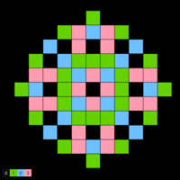
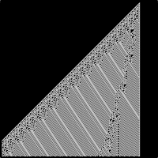
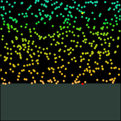

# dave.Complexity 

version 0.4.0

[dave.Complexity](https://github.com/sixhat/dave.complexity) is a set of toy-models
written in [p5](https://p5js.org/) that illustrate topics in complex systems.

Each folder consists of one example. 

## Implemented

* [Sandpile](https://www.sixhat.net/p5/dave.complexity/sandpile-Bak-Tang-Wiesenfeld/)
* [1D automata](https://www.sixhat.net/p5/dave.complexity/automata-1D/)
* [Bak-Sneppen species evolution](https://www.sixhat.net/p5/dave.complexity/evolution-soc-Bak-Sneppen/)
* [Koch curve and Cesàro fractals](https://www.sixhat.net/p5/dave.complexity/fractal-l-system-koch-curve/)

## Not Implemented Yet (@todo)

* Forest Fire
* 2D Life (SxBy) version
* Fractals
* Sponge
* Boids
* Swarm Intelligence
* ... 

## Thanks

The following libraries / open source projects were used in the development 
of these examples

* [p5](https://p5js.org/) is licensed under LGPL 2.1
* [p5.gui](https://github.com/bitcraftlab/p5.gui) is licensed under MIT.
* [Hsluv](https://github.com/hsluv/hsluv) is licensed under MIT.
* [Quicksettings.js](https://github.com/bit101/quicksettings) is licensed under MIT.
<!-- * [underscore.js](http://underscorejs.org/) is licensed under MIT. -->

